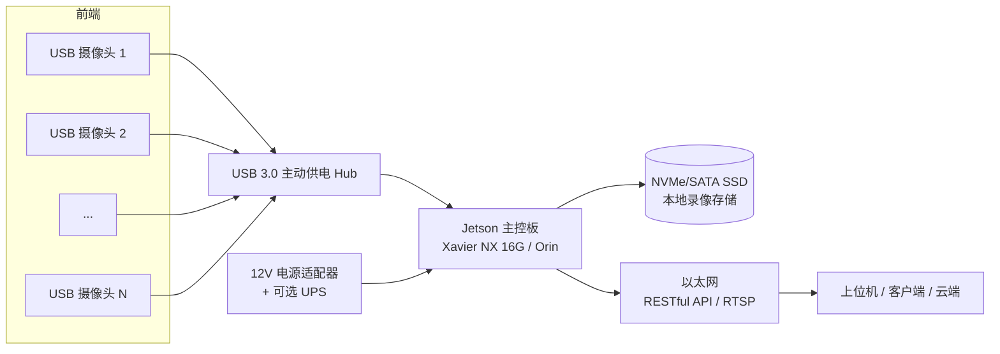

# 摄像机系统硬件选型方案
> [!NOTE]
> **设计/调研文档（历史）**：本文档为早期设计与选型参考，**不代表当前实现**。
> 当前已实现并部署的系统见 [README.md](../README.md) 与 [07-当前实现与运维手册.md](07-当前实现与运维手册.md)。

## 1. 需求概述

| 需求项 | 说明 |
|--------|------|
| 摄像头接口 | USB（UVC 免驱，Linux 即插即用） |
| 主控平台 | NVIDIA Jetson（Xavier NX 16G 原型 / Orin 量产） |
| 功能 | 多路视频采集 → 本地硬盘连续录像；通过网络 RESTful API 调用拍照/录像 |
| 工作模式 | 7×24 小时连续运行，嵌入式/边缘部署 |

## 2. 系统总体框图

## 3. 摄像头选型

### 3.1 选型要点

1. **接口与协议**：USB 2.0/3.0 + UVC 1.1/1.5。UVC 是标准免驱协议，Linux 内核 `uvcvideo` 驱动直接支持，无需厂商 SDK。
2. **输出格式（最关键）**：
   - **H.264 直出（首选）**：带宽最低（1080p30 约 4~10 Mbps），板端无需解码，直接硬件转封装落盘。如 Logitech C920/C922、部分工业 UVC 模组支持（UVC 1.5）。
   - **MJPEG（推荐兼容方案）**：带宽 1080p30 约 30~80 Mbps（视场景复杂度），板端需解码后重新编码 H.264。
   - **YUY2 裸流（避免）**：1080p30 约 995 Mbps，仅限 1~2 路且必须走 USB 3.0。
3. **分辨率/帧率**：默认 1080p@30fps；按场景可选 720p（更多路数）或 4K（少路数高画质）。
4. **镜头**：固定机位推荐**定焦**（3.6mm / 6mm / 8mm 按视场角选择），避免自动对焦在弱光、远距、遮挡场景反复拉风箱导致画面抖动。
5. **传感器**：室内常规 1/2.7" CMOS；低照度场景选 Sony IMX 系列（IMX291/IMX307 等）1/2.8" 大像元传感器。
6. **供电与电流**：普通 USB 摄像头 ≤500mA；工业模组确认最大电流，多路叠加必须配主动供电 Hub，防止掉帧/掉线。
7. **可靠性**：量产建议工业/准工业级（宽温 -20~70℃、7×24 连续工作）。
8. **帧同步**：USB 摄像头无硬件同步，多路用软件时间戳对齐（NTP 校时 + 采集时刻打 UTC 时间戳）。

### 3.2 候选对比

| 类别 | 型号示例 | 分辨率/帧率 | 输出格式 | 参考价 | 适用阶段 |
|------|----------|-------------|----------|--------|----------|
| 消费级 | Logitech C920 / C922 | 1080p30 | H.264 + MJPEG + YUY2 | ¥300~600 | 原型验证，驱动/协议兼容性最好 |
| 准工业 | 海康威视 DS-UVC 系列 | 1080p30 | MJPEG（部分 H.264） | ¥300~800 | 原型/小批量 |
| 工业模组 | 国产 1080p UVC 定焦模组（IMX291/IMX307，3.6mm 等） | 1080p30 | MJPEG / 可选 H.264 | ¥80~250/个 | 量产 |
| 高速/全局快门 | USB3.0 全局快门模组（IMX265/IMX178 等） | 720p~1080p@60-120 | MJPEG / YUY2 | ¥500~2000 | 运动/高速场景 |
| 低成本 720p 模组 | **OV9734** UVC 模组（迷你摄像头/内窥镜/普通 720p 摄像头） | 720p30 | MJPEG / YUY2 | ¥60~150/个 | **12 路多路低成本（本需求指定）** |
| 4K 高画质 | 4K UVC 摄像头（8MP，IMX415 等） | 4K30 | MJPEG | ¥500~1500 | 高分辨率取证 |

### 3.3 推荐结论

- **原型阶段**：Logitech C920 ×2 起步（Linux 兼容性好、支持 H.264 直出），跑通后再评估工业模组。
- **量产阶段**：工业级 1080p30 UVC 定焦模组，**优先选支持 H.264 直出的版本**；与主控板方案商联合预调试，确认多路同时枚举与供电稳定性。
- **OV9734（本需求指定）**：720p30、UVC 免驱、成本低，适合 12 路多路场景；注意其 1/9" 小靶面弱光性能一般，且多为 MJPEG 输出（板端需硬件解码）。详见 [03-OV9734与12路方案.md](03-OV9734与12路方案.md)。

## 4. 主控板选型

### 4.1 Jetson 平台对比

| 平台 | CPU | GPU | 内存 | H.264 硬件编码 | 定位 |
|------|-----|-----|------|----------------|------|
| **Jetson Xavier NX 16G** | 6×Carmel（ARMv8.2） | 384 CUDA + 48 Tensor（21 TOPS） | 16GB | **20×1080p30** | **12 路主力（本方案选型）** |
| Jetson Orin NX 16G | 8×Cortex-A78AE | 1024 CUDA + 32 Tensor（100 TOPS） | 16GB | 1×8K30 / 2×4K60 等 | 量产升级路径（无 EOL 风险） |
| Jetson Orin Nano 8G | 6×Cortex-A78AE | 1024 CUDA（40 TOPS） | 8GB | 4×1080p60 等 | 低成本量产备选 |

> 说明：Xavier NX 16G 的硬件 H.264 编码能力为 **20×1080p30**（≈1244 Mpix/s），做 12 路 720p30 录像 + 抓拍余量充足，CPU 占用很低；16G 版 21 TOPS 还为后续 AI 能力预留了升级路径。

> **12 路结论**：12×720p30 编码约需 332 Mpix/s，Xavier NX 16G（≈1244 Mpix/s）余量近 4 倍。详见 [03-OV9734与12路方案.md](03-OV9734与12路方案.md)。

### 4.2 板卡对比（原型 / 量产）

| 板卡 | 平台 | 内存 | 存储扩展 | USB 口 | 网络 | 参考价 | 特点 |
|------|------|------|----------|--------|------|--------|------|
| Jetson Xavier NX 开发套件 | Xavier NX 16G | 16GB | microSD + M.2 NVMe | USB3.1×4 | 千兆 | ¥1500~3500 | **原型首选**（手头已有） |
| Jetson Xavier NX 模组 + 载板 | Xavier NX 16G | 16GB | 按载板 | 按载板（≥3×USB3） | 按载板 | ¥1500~3500 | 小批量 / 定制载板 |
| Jetson Orin NX 16G 模组 + 载板 | Orin NX 16G | 16GB | M.2 NVMe | 按载板（≥3×USB3） | 千兆/2.5G | ¥3000~5000 | **量产升级路径**（无 EOL 风险） |

### 4.3 推荐结论

| 阶段 | 推荐 |
|------|------|
| 原型（1~2 周出 Demo） | **Jetson Xavier NX 16G**（已有设备）+ NVMe 1TB |
| 量产 | **Jetson Orin NX 16G 模组 + 定制载板**（≥3×USB3.0）；小批量可继续用 Xavier NX 16G |

## 5. 存储选型

- **介质**：连续录像推荐 **NVMe SSD（M.2 2280，TLC 颗粒）**；SATA SSD 亦可（8 路写入仅 ~4~8MB/s，SATA 带宽足够）。避免用 TF 卡做主力录像（寿命/速度不足）。
- **分区策略**：系统装在 eMMC/microSD，录像盘独立挂载（如 `/data`），互不影响。
- **容量估算**（H.264 硬件编码后落盘）：

| 码率 | 单路/天 | 4 路/天 | 8 路/天 | 1TB（8 路可存） | 4TB（8 路可存） |
|------|---------|---------|---------|-----------------|-----------------|
| 4 Mbps（标准） | 43.2 GB | 173 GB | 346 GB | ~2.9 天 | ~11.6 天 |
| 6 Mbps（推荐） | 64.8 GB | 259 GB | 518 GB | ~1.9 天 | ~7.7 天 |
| 8 Mbps（高质量） | 86.4 GB | 346 GB | 691 GB | ~1.4 天 | ~5.8 天 |

- **重要提示**：若摄像头直出 MJPEG 且**不转码直接落盘**，码率通常 20~60 Mbps，存储需求放大 5~10 倍；强烈建议板端硬件转 H.264 后再落盘（见软件文档）。
- **留存策略**：软件按配额循环覆盖（见软件文档 §3.3）。

## 6. 周边选型

| 项目 | 建议 | 说明 |
|------|------|------|
| USB Hub | USB 3.0 主动供电（5V/3A+），金属外壳 | 避免多路供电不足导致掉帧/掉线；4 口以上分两个 Hub 分散到不同 USB 控制器 |
| 电源 | 12V/5A DC 或 USB-C PD（按板卡），建议加 UPS/电池 | 掉电保护 + 录像文件完整性 |
| 网络 | 千兆交换机 + 板卡 2.5G/千兆口 | API 流量小，主要预留 RTSP 预览/回放带宽 |
| 散热 | 金属机箱 + 散热片，Jetson 满载建议主动风扇 | 12 路满载发热明显，SSD 也需通风 |
| 防护 | 户外加防雷/TVS/ESD | 按部署环境选配 |

## 7. 推荐配置清单（BOM）

### 7.1 原型套件（2~4 路，含软件联调）

| 项目 | 型号 | 数量 | 参考价 |
|------|------|------|--------|
| 主控板 | Jetson Xavier NX 16G 开发套件 | 1 | ¥1500~3500 |
| 摄像头 | Logitech C920 | 2~4 | ¥300/个 |
| USB Hub | 4 口 USB3.0 主动供电 | 1~2 | ¥100 |
| 录像盘 | NVMe SSD 1TB（致态/三星等） | 1 | ¥400 |
| 电源 | 12V/5A 适配器 | 1 | ¥60 |
| **合计** | | | **约 ¥2800~5300** |

### 7.2 量产形态（12 路，OV9734）

| 项目 | 说明 |
|------|------|
| 主控 | **Jetson Orin NX 16G** 模组 + 定制载板（≥3 路 USB3.0）；小批量用 Xavier NX 16G |
| 摄像头 | OV9734 720p UVC 模组 ×12 |
| USB Hub | USB3.0 主动供电 4 口 ×3（分散到 3 个 USB3.0 控制器） |
| 存储 | NVMe 2~4TB（约 5~20 天留存，按 1.5~3Mbps/路） |
| 电源/机箱 | 金属机箱 + 12V/10A + 主动散热 |
| 网络 | 双千兆（业务 + 管理） |
| 成本 | 约 ¥3500~6000（详见 03 文档 §3.9） |

## 8. 关键参数核算

- **USB 带宽**：1080p30 MJPEG ≈ 30~80 Mbps/路。USB3.0 单控制器实际可用约 4.5 Gbps，可承载约 8~12 路 MJPEG。**建议单控制器 ≤8 路**，更多路分散到多个 USB 3.0 控制器 / 根端口。若用 H.264 直出相机，带宽占用可忽略不计。
- **编码能力**：Jetson Xavier NX 16G 支持 20×1080p30 H.264 编码（nvv4l2h264enc），12 路录像 + 抓拍余量充足。
- **720p 核算**：12×720p30 MJPEG 输入约 360 Mbps，分散到 3 个 USB3.0 控制器每路约 120~180 Mbps；编码需求约 332 Mpix/s，Xavier NX 16G（≈1244 Mpix/s）余量近 4 倍。
- **CPU 占用**：全链路走硬件（V4L2 → nvjpeg GPU 解码 → nvvidconv 转换 → nvv4l2h264enc 硬编），12 路 720p CPU 占用通常 <20%。
- **磁盘写入**：6 Mbps × 8 路 ≈ 6 MB/s 持续写入，NVMe/SATA 均无压力。

## 9. 注意事项与风险

| 风险 | 对策 |
|------|------|
| 多路 UVC 掉线/枚举失败 | 用成熟模组 + 主动供电 Hub + 软件自动重连（udev + 轮询） |
| 自动对焦画面漂移 | 固定机位用定焦或锁定对焦 |
| 多路时间不同步 | NTP 校时 + 采集时统一打 UTC 时间戳 |
| 掉电损坏录像 | 短分段（1~5 分钟）及时落盘 + moov 前置 + 电源 UPS |
| Jetson 过热降频 | 散热片 + 风扇，机箱风道设计；20W 模式必须主动散热 |
| 硬盘寿命 | TLC 颗粒 + 循环覆盖减少写入放大 + SMART 健康监测 |

---
*文档版本：v1.0（2026-08）*
