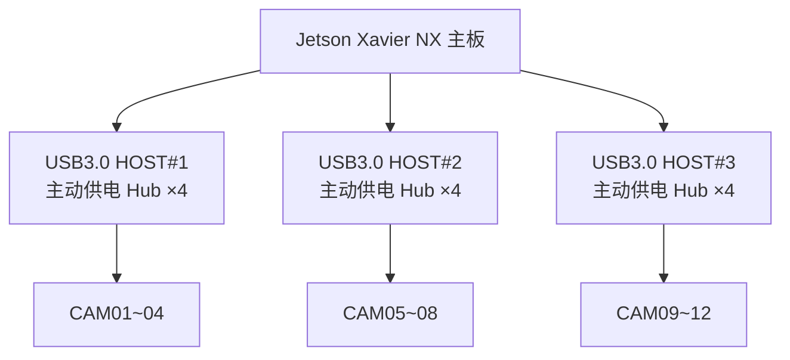

# OV9734 摄像头 + 12 路方案专项设计
> [!NOTE]
> **设计/调研文档（历史）**：本文档为早期设计与选型参考，**不代表当前实现**。
> 当前已实现并部署的系统见 [README.md](../README.md) 与 [07-当前实现与运维手册.md](07-当前实现与运维手册.md)。


> 前置：本方案基于「摄像头 = OV9734 传感器 USB UVC 模组」这一前提，目标为 **12 路 720p30 同时录像 + 拍照 API**。

## 1. OV9734 传感器与摄像头特点

| 参数 | 规格 |
|------|------|
| 厂商/型号 | OmniVision OV9734 |
| 有效像素 | 1 MP（1280×720） |
| 分辨率/帧率 | 720p@30fps；VGA@45fps |
| 传感器尺寸 | 1/9"（小靶面） |
| 接口 | 传感器支持 DVP / MIPI CSI-2；成品模组经 USB UVC 桥接芯片输出 |
| USB 协议 | UVC 免驱，USB 2.0（High-Speed） |
| 输出格式 | 通常 **MJPEG / YUY2**（多数模组不支持 H.264 直出） |
| 功耗 | 低功耗（比上一代 720p 传感器省约 25%） |
| 定位 | 低成本，常见于迷你摄像头、内窥镜、普通 720p USB 摄像头 |

**特点与限制**
- 分辨率上限 **720p**，无 1080p 能力；
- 1/9" 小靶面 → **弱光性能一般**，适合光照充足的室内固定机位；暗光/夜视场景应换大靶面传感器（IMX291/IMX307 等）；
- 多为 MJPEG 输出 → 12 路需板端硬件解码（Jetson GPU nvjpeg 解码）后再编码 H.264；
- 成本低，适合「路数多、单路 720p」的场景，与 12 路需求匹配。

## 2. Jetson 平台编码能力与选型

| 平台 | CPU | GPU | 内存 | H.264 硬件编码 | 定位 |
|------|-----|-----|------|----------------|------|
| **Jetson Xavier NX 16G** | 6×Carmel | 384 CUDA + 48 Tensor（21 TOPS） | 16GB | **20×1080p30** | **12 路主力（本方案选型）** |
| Jetson Orin NX 16G | 8×A78AE | 1024 CUDA + 32 Tensor（100 TOPS） | 16GB | 1×8K30 / 2×4K60 等 | 量产升级路径 |
| Jetson Orin Nano 8G | 6×A78AE | 1024 CUDA（40 TOPS） | 8GB | 4×1080p60 等 | 低成本量产备选 |

**编码吞吐核算（像素/秒）**

| 分辨率 | 吞吐 |
|--------|------|
| 1080p30 | 1920×1080×30 ≈ 62.2 Mpix/s |
| 720p30 | 1280×720×30 ≈ 27.6 Mpix/s |
| 12 路 720p30 需求 | 332 Mpix/s |
| Xavier NX 16G 编码能力 | 20×1080p30 ≈ **1244 Mpix/s** ≈ **45 路 720p30** |

**结论：12 路 720p30 用 Xavier NX 16G 编码余量近 4 倍。** 即使只做 MJPEG 直存不做 H.264 转码，12 路 MJPEG 存储开销也高达 200~600 GB/天，因此仍走"GPU 解码 + 硬件转码 H.264"路线。

## 3. 12 路方案设计要点

### 3.1 主控选型
- **Jetson Xavier NX 16G**（手头已有；16G=21 TOPS 预留 AI），原型直接用开发套件；量产升级 **Orin NX 16G** 模组 + 定制载板。

### 3.2 USB 拓扑与带宽
- OV9734 720p30 MJPEG 实际带宽约 **15~40 Mbps/路**（按 30 Mbps 预算）；
- 12 路合计 ≈ **360 Mbps**，带宽本身不是问题，瓶颈在**单控制器枚举数量与供电**；
- 推荐拓扑（分散到多个 USB3.0 根端口/控制器，Xavier NX 载板通常 4×USB3，避免单点故障拖垮全局）：



- 每个根端口实际负载约 120~180 Mbps（< 5Gbps 的 4%），余量充足；
- 全部用**主动供电 USB3.0 Hub**（5V/4A+），每路独立过流保护；
- 用 udev 规则按 USB 端口/序列号固定 `/dev/cam01~cam12`，防止热插拔后设备名漂移。

### 3.3 媒体管道（全硬件）

```
V4L2 (MJPEG) → nvjpeg GPU 解码 → nvvidconv 转 NV12 → nvv4l2h264enc 硬编 → MP4 分段落盘
```

- 12×720p30 的 MJPEG 解码 + H.264 编码全部走 Jetson GPU/硬件，CPU 占用预计 <20%（含应用层）；
- 建议码率：720p 每路 **1.5~3 Mbps**（静态场景 1.5，动态场景 3）；
- 若后续更换支持 H.264 直出的摄像头，可跳过 JPEG 解码环节，进一步降负载。

### 3.4 存储

| 码率 | 单路/天 | 12 路/天 | 2TB 可存 | 4TB 可存 |
|------|---------|----------|----------|----------|
| 1.5 Mbps | 16.2 GB | 194 GB | ~10 天 | ~20 天 |
| 2 Mbps | 21.6 GB | 259 GB | ~7.7 天 | ~15 天 |
| 3 Mbps | 32.4 GB | 389 GB | ~5 天 | ~10 天 |

- 推荐：NVMe **2TB（短留存）** 或 **4TB（中留存）**；12 路持续写入仅 2~5 MB/s；
- 采用配额循环覆盖（最旧删除）。

### 3.5 供电

- 摄像头侧：12 × 0.3~0.5A ≈ **4~6A（5V）**，由 2~3 个主动供电 Hub 分摊；
- 整机：**12V/10A DC**（或 12V/5A + Hub 独立适配器）；
- 建议 UPS/缓启动，避免 12 路上电浪涌。

### 3.6 散热与结构

- Jetson 20W 模式下 12 路媒体负载发热明显 → **主动散热（风扇）+ 金属机箱风道**；
- 12 个 USB 接口布局：前面板 3×Hub 集中出线，或定制底板上直连 12 个 USB 座。

### 3.7 软件要点（详见软件文档 §12）

- 每路独立进程（12 个采集/编码 worker），故障隔离；
- udev 热插拔 + 自动重连；watchdog 看门狗保活；
- systemd 资源限制（CPU/内存/句柄数）；
- NTP 校时 + 每帧 UTC 时间戳；
- SQLite WAL + 单写连接；录像段 1~5 分钟、moov 前置；
- 存储配额循环覆盖 + 空间告警；
- 12 路监控面板：帧率 / 掉帧数 / 温度 / 磁盘实时状态。

### 3.8 验收测试项

| 测试 | 通过标准 |
|------|----------|
| 12 路同时枚举 | 上电后 2 分钟内全部出现在 /dev |
| 12 路同时录像 7×24 | 无掉线、无死锁，掉帧率 <0.1% |
| 单路热插拔 | 不影响其余 11 路，自动重连恢复录像 |
| 掉电恢复 | 重启后已录段可播放、索引重建 |
| 带宽余量 | 每个 USB 控制器实际占用 <50% |
| 温度 | 满载外壳 <50℃、芯片 <80℃ |

### 3.9 成本估算（12 路）

| 项目 | 说明 | 参考价 |
|------|------|--------|
| 主控 | Jetson Xavier NX 16G 模组+载板（已有；新购 ¥1500~3500） | ¥1500~3500 |
| 摄像头 | OV9734 UVC 模组 ×12 | ¥60~150/个 |
| USB Hub | USB3.0 主动供电 4 口 ×3 | ¥300 |
| 存储 | NVMe 2~4TB | ¥700~1600 |
| 电源机箱 | 12V/10A + 金属机箱 + 风扇 | ¥400~800 |
| **合计** | | **约 ¥3500~6000** |

## 4. 结论

1. **主控用 Jetson Xavier NX 16G**：12 路 720p30 编码需约 332 Mpix/s，Xavier NX（≈1244 Mpix/s，20×1080p30）余量近 4 倍；
2. **USB 分散**：Xavier NX 载板多个 USB3.0 根端口各挂 3~4 路 + 主动供电 Hub，规避枚举与供电风险；
3. **全硬件媒体管道**：MJPEG 解码 + H.264 编码走 nvjpeg/nvvidconv/nvv4l2，CPU 占用低；
4. **软件自愈**：独立进程 + 热插拔重连 + 看门狗，保证 7×24 稳定性；
5. **存储**：NVMe 2~4TB + 配额循环覆盖，留存 5~20 天。

---
*文档版本：v1.0（2026-08）*
